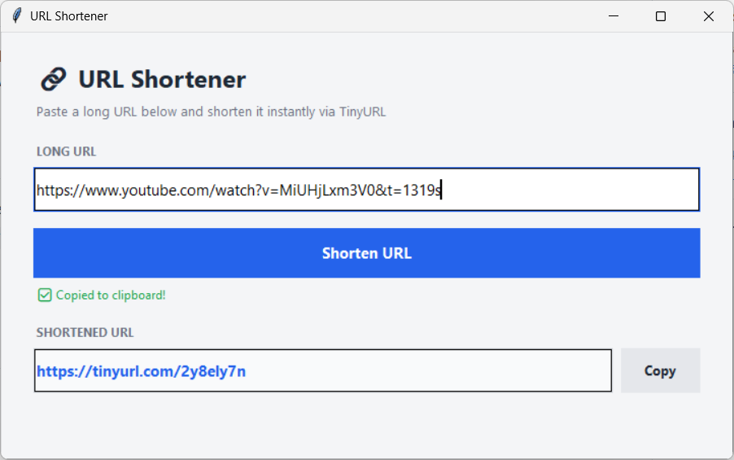

<div align="center">

# 🔗 URL Shortener

**A clean, modern desktop GUI for shortening long URLs — powered by the TinyURL API.** ⚡

Paste a URL, hit shorten, and the short link is copied to your clipboard automatically.



</div>

---

## ✨ Features

| | |
|---|---|
| ✂️ **One-Click Shortening** | Paste a long URL and shorten it instantly via the TinyURL API |
| 📋 **Auto-Copy to Clipboard** | The shortened URL is copied automatically the moment it's ready |
| 🖱️ **Manual Copy Options** | Use the **Copy** button, or select the text and copy it yourself |
| 🖥️ **Centered Window** | Opens centered on your screen, no matter your monitor setup |
| 📐 **Resizable & Roomy** | Wide enough to comfortably fit long URLs, resizable in both directions |
| 🎨 **Modern, Minimal UI** | Clean flat design with hover states — no clutter |
| ⚙️ **Zero Dependencies** | Built entirely with Python's standard library — no extra installs needed |

---

## 🚀 Getting Started

### System Requirements

- 🐍 Python 3.x
- 🪟 `tkinter` (comes pre-installed with Python on most systems)
- 🌐 An active internet connection (required to reach the TinyURL API)

### Installation & Run

1. **Clone the repo**
   ```bash
   git clone https://github.com/moturkmani/long2shortURL.git
   cd long2shortURL
   ```

2. **Run it**
   ```bash
   python url_shortener.py
   ```

   No dependencies to install — it runs with a standard Python installation.

---

## 📖 Usage

1. **Paste** your long URL into the input field
2. Click **Shorten URL** (or press **Enter**)
3. The shortened link appears in the result field and is **automatically copied to your clipboard** ✅
4. Need it again? Click **Copy**, or select the text in the result field and copy it manually

---

## 🗂️ File Structure

```
url-shortener/
├── url_shortener.py   # 🧠 Main application script
└── assets/
    └── image1.png      # 🖼️ App screenshot
```

---

## 🩹 Troubleshooting

| Issue | Fix |
|---|---|
| ❌ Error shortening URL | Check your internet connection — the app needs to reach the TinyURL API |
| 🚫 Nothing happens on click | Make sure a URL was actually entered in the input field |
| 📋 Clipboard didn't update | Try clicking the **Copy** button manually |

---

## 📝 Notes

- ⏳ TinyURL occasionally shows a brief interstitial "redirecting" page before landing on the destination site — this is standard TinyURL behavior on their end, not something this app controls.
- 🔗 No API key or account is required — this app uses TinyURL's free, anonymous shortening endpoint.

---

## 📜 License
MIT License

Copyright (c) 2026 Mo Turkmani

Permission is hereby granted, free of charge, to any person obtaining a copy
of this software and associated documentation files (the "Software"), to deal
in the Software without restriction, including without limitation the rights
to use, copy, modify, merge, publish, distribute, sublicense, and/or sell
copies of the Software, and to permit persons to whom the Software is
furnished to do so, subject to the following conditions:

The above copyright notice and this permission notice shall be included in all
copies or substantial portions of the Software.

THE SOFTWARE IS PROVIDED "AS IS", WITHOUT WARRANTY OF ANY KIND, EXPRESS OR
IMPLIED, INCLUDING BUT NOT LIMITED TO THE WARRANTIES OF MERCHANTABILITY,
FITNESS FOR A PARTICULAR PURPOSE AND NONINFRINGEMENT. IN NO EVENT SHALL THE
AUTHORS OR COPYRIGHT HOLDERS BE LIABLE FOR ANY CLAIM, DAMAGES OR OTHER
LIABILITY, WHETHER IN AN ACTION OF CONTRACT, TORT OR OTHERWISE, ARISING FROM,
OUT OF OR IN CONNECTION WITH THE SOFTWARE OR THE USE OR OTHER DEALINGS IN THE
SOFTWARE.
---

<div align="center">

Made with 🐍 + ❤️ for quick, clutter-free link sharing

</div>
